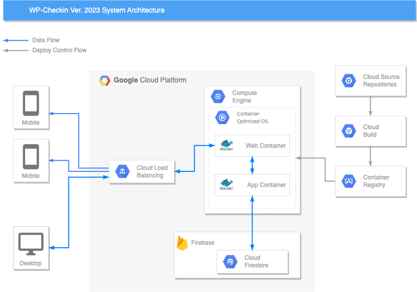

# wp-checkin
A check-in helper for WordCamp Tokyo 2023

## システム構成

このシステムは、Docker 環境下で動作することを前提としています。

WordCamp Tokyo 2023 で使用した本システムの構成は以下の通りです。



WordCamp Tokyo 2023 では、GCP上にシステムを構築しました。
GCE(Container Optimized OS) に `App` と `Web` という二つのコンテナを構築し、チケットデータは別に、Firebase 内の FireStore においています。

また、ドメインは Load Balancer で扱い、外部との通信は全てここを通して行うように構築しています。

今回は GCE 上に構築しましたが、Kubernetes に詳しい場合は、GKE で構築した方が楽かも知れません。

データを FireStore に置いた関係上、GCP を使用しましたが、そこにこだわらないのであれば、AWS の ECS などを使うことも可能です。

ちなみにデプロイは、Cloud Source Repositories に登録したソースを、Cloud Build でビルドして、Container Registry に登録し、それを GCE にデプロイする形で行っていました。

これも、自動化する事が出来ると思います。

## 開発環境

### 事前準備

本システムでは、Docker を使用しているため、ローカル環境で開発を行う場合、Docker が必要となります。

また、Firebase のアカウントを作成し、予め FireStore に `Tickets` という名前でコレクションを作成しておきます。

### インストール

最初に、`docker-compose.local.sample.yml` をコピーして、`docker-compose.local.yml` というファイルを生成します。
```shell
cp docker-compose.local.sample.yml docker-compose.local.yml
```
`docker-compose.local.yml` を自分のシステムにあわせて、編集します。
Docker をビルドします。

```shell
docker compose -f docker-compose.local.yml build
```

ビルドには、それなりに時間が掛かります。

ビルドが完了したら、以下のように Docker を立ち上げます。

```shell
docker compose -f docker-compose.local.yml up
```

これで完了です。

`http://localhost` でシステムにアクセス出来ます。

## 余談
### 各ページの簡単な説明

* `/` ホーム
* `/search` チケット検索
* `/export` チケットデータのCSVエクスポート
* `/import` チケットデータのインポート (WP-TixからエクスポートしたCSVファイル形式のみサポート)

詳しくは、`/app/includes/routes.php` を見てください

